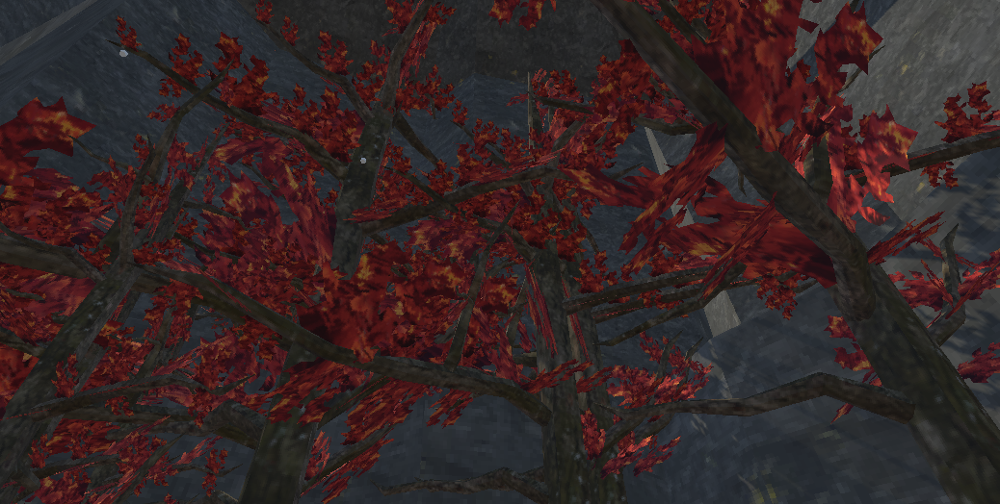
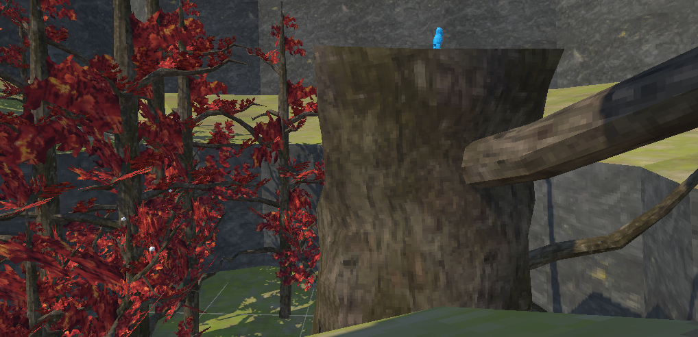
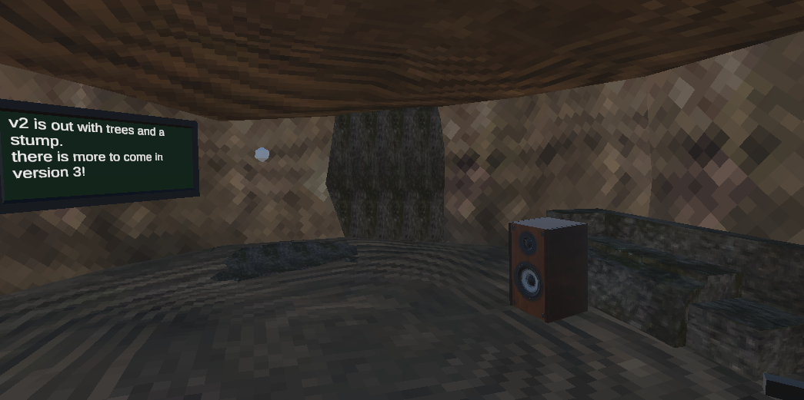

# Catch De Monke.
A Gorilla Tag fangame by Arielcorporations
# How to install
get the latest release from (https://github.com/arielcorporations/catch-de-monke/releases install) the .apk file and sideload it to vr
# Credits
Credits:
- "Speaker" (https://skfb.ly/6QUXG) by futaba@blender is licensed under Creative Commons Attribution (http://creativecommons.org/licenses/by/4.0/).
- "Gorilla Tag Trees Asset Pack" (https://skfb.ly/oIWsR) by KPMisParrot is licensed under Creative Commons Attribution (http://creativecommons.org/licenses/by/4.0/).
- "Gorilla Tags New Stump" (https://skfb.ly/prpSB) by goofybrian is licensed under Creative Commons Attribution (http://creativecommons.org/licenses/by/4.0/).
- "Gorilla Tag Player Model Unity 3d" (https://skfb.ly/oq89N) by worpcapsule is licensed under Creative Commons Attribution (http://creativecommons.org/licenses/by/4.0/).
- Movement system inspired used in Gorilla Tag, developed by Another Axiom, used under the MIT License.
- Footstep sounds from "StelSteps" found on Discord.
- Background music from lofi
* Massive thanks to all listed above!
# Another Axiom's MIT license
MIT License

Copyright (c) 2021 Another-Axiom

Permission is hereby granted, free of charge, to any person obtaining a copy
of this software and associated documentation files (the "Software"), to deal
in the Software without restriction, including without limitation the rights
to use, copy, modify, merge, publish, distribute, sublicense, and/or sell
copies of the Software, and to permit persons to whom the Software is
furnished to do so, subject to the following conditions:

The above copyright notice and this permission notice shall be included in all
copies or substantial portions of the Software.

THE SOFTWARE IS PROVIDED "AS IS", WITHOUT WARRANTY OF ANY KIND, EXPRESS OR
IMPLIED, INCLUDING BUT NOT LIMITED TO THE WARRANTIES OF MERCHANTABILITY,
FITNESS FOR A PARTICULAR PURPOSE AND NONINFRINGEMENT. IN NO EVENT SHALL THE
AUTHORS OR COPYRIGHT HOLDERS BE LIABLE FOR ANY CLAIM, DAMAGES OR OTHER
LIABILITY, WHETHER IN AN ACTION OF CONTRACT, TORT OR OTHERWISE, ARISING FROM,
OUT OF OR IN CONNECTION WITH THE SOFTWARE OR THE USE OR OTHER DEALINGS IN THE
SOFTWARE.
# Screenshots

# Thanks
Thank you for downloading, hope you enjoyed
